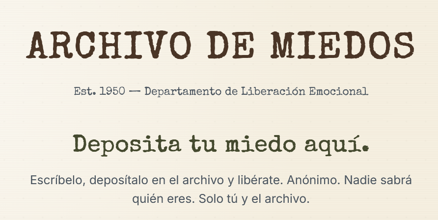
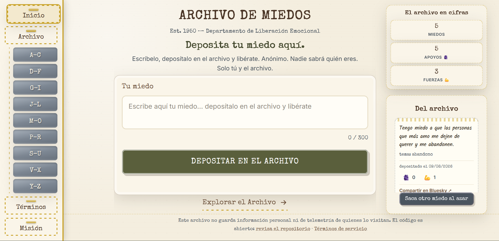
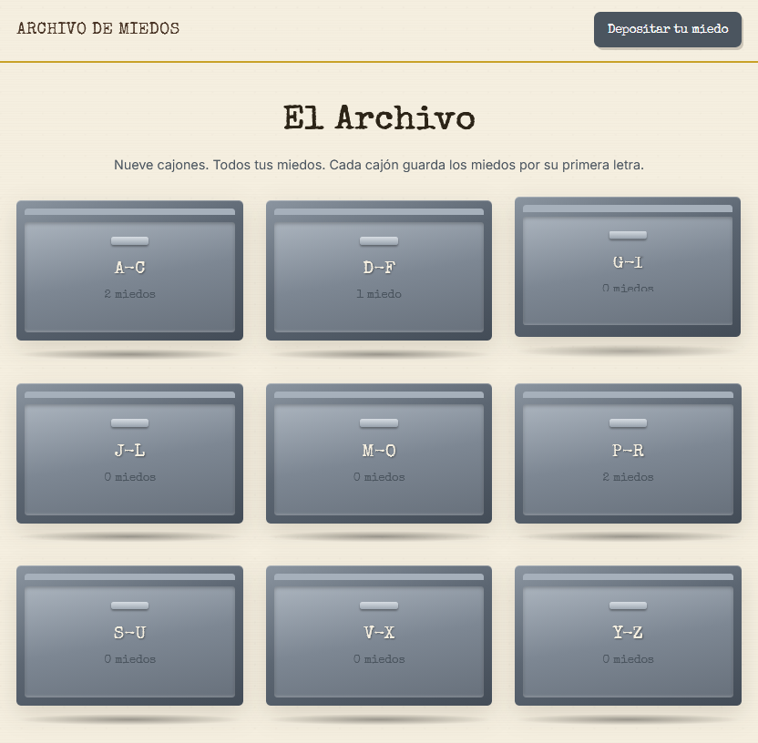
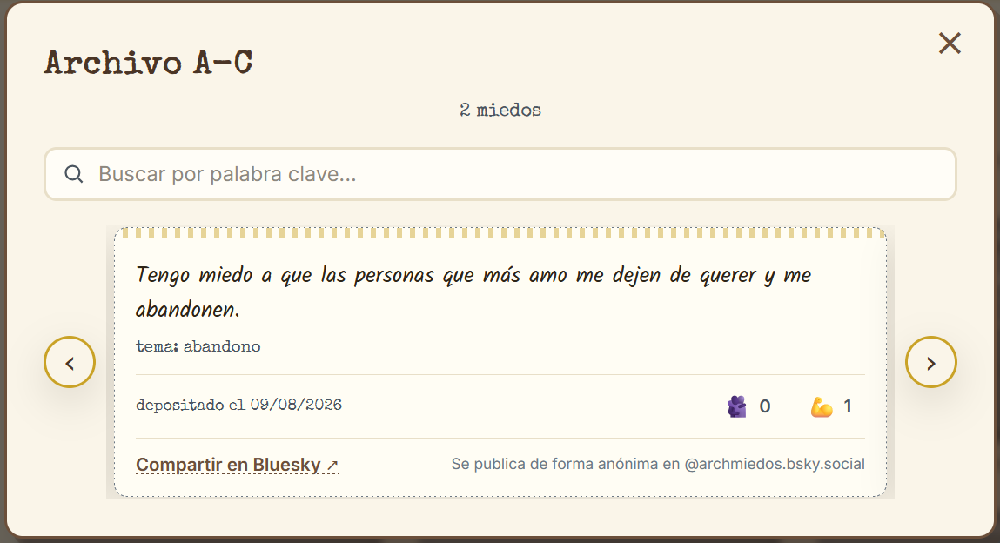

# 📁 Archivo de Miedos

> *"Deposita tu miedo en el archivo y libérate."*

Una oficina secreta de los años 50 donde la gente deja sus miedos. En serio.

Escribe tu miedo, deposítalo en el archivador correcto y olvídate de él. Anónimo, sencillo y sin juicios. Nadie sabe quién eres: solo tú y el archivo.

---

## ¿De qué se trata?

Todos cargamos con miedos: a fracasar, a no ser suficientes, a las arañas, a que nadie nos entienda. El Archivo de Miedos es un espacio colectivo y anónimo para sacarlos de la cabeza y dejarlos escritos en papel (digital, claro).

Algunas personas encuentran alivio con solo escribirlo. Otras encuentran consuelo al descubrir que no están solas: los miedos de los demás se parecen mucho a los tuyos.

## ¿Cómo se usa?

Es muy fácil. No necesitas cuenta, correo ni contraseña.

1. **Deposita tu miedo.** En la portada, escribe lo que te da miedo (entre 10 y 300 caracteres) y pulsa *"Depositar en el Archivo"*. Eso es todo.

   

2. **Explora el archivo.** Nueve archivadores de oficina guardan los miedos por el **tema real que los provoca** — una inteligencia artificial clasifica cada depósito y lo archiva donde corresponde (por ejemplo, *"tengo miedo a las arañas"* queda en la A). Abre un cajón y recorre las fichas como un **carrusel**: flechas en escritorio o desliza con el dedo en el móvil.

   

3. **Busca.** Dentro de cada cajón puedes buscar por palabra clave. ¿Miedo a la oscuridad? Busca "oscu" y verás que no eres el único.

4. **Acompaña.** Si un miedo te llega, puedes dejarle **🫂 Apoyo** o **💪 Fuerza**. Es tu forma de decirle a un desconocido: *"te leo y no estás solo"*. Cada persona puede dar cada reacción una sola vez.

   

## Lo que hace especial a este lugar

- **Anónimo de verdad.** No se pide nombre, correo ni datos personales. No hay cuentas, no hay perfiles, no hay seguimiento.
- **Sin juicios.** Un miedo no se juzga: se archiva.
- **Moderado con cuidado.** Cada miedo pasa por una revisión automática con inteligencia artificial y, cuando hace falta, por revisión humana, para que el archivo siga siendo un espacio seguro.
- **Clasificado por IA.** Una inteligencia artificial identifica el miedo de fondo de cada depósito y lo archiva en el cajón que le corresponde por tema.
- **Compartir anónimo en Bluesky.** Desde cualquier ficha puedes compartir el miedo (sin tu identidad) en la cuenta **@archmiedos.bsky.social**, con una tarjeta que muestra su texto, fecha y reacciones.
- **Código abierto.** Puedes revisar exactamente cómo funciona este sitio, qué datos guarda y cuáles no. [Mira el código en GitHub](https://github.com/nocloudware/ArchMiedos).

## Enlaces

- 🌐 **Sitio en vivo:** https://archmiedos.nocloudware.com
- 📖 **Términos de servicio:** https://archmiedos.nocloudware.com/terminos.html
- 🐙 **Repositorio:** https://github.com/nocloudware/ArchMiedos
- 🛠️ **Detalles técnicos:** [IMPLEMENTACION.md](IMPLEMENTACION.md)

---

*Si algo te preocupa o tienes una duda, escríbenos a archmiedos@hotmail.com.*
